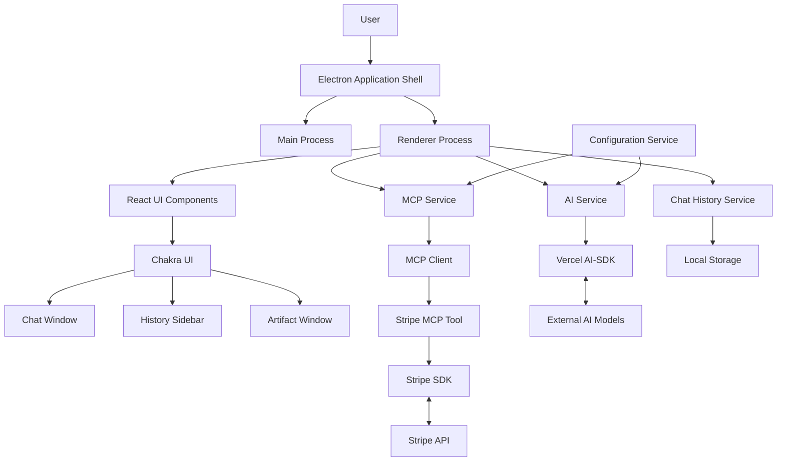

# Vibestation Architecture Documentation

## Table of Contents

1. [System Architecture](architecture.md)
2. [Component Diagram](component-diagram.md)
3. [Data Flow](data-flow.md)
4. [Security Architecture](security-architecture.md)
5. [Implementation Guide](implementation-guide.md)

## Architecture Overview

Vibestation is a desktop application that enables users to interact with AI models and utilize external tools (MCPs) to perform various tasks, including integration with third-party services like Stripe. The application is designed to run locally on a user's computer, providing a user-friendly interface for AI interaction while maintaining security for API keys and sensitive data.

### Key Architecture Principles

- **Modularity**: Clear separation of concerns with well-defined component boundaries
- **Security**: Secure handling of API keys and sensitive data
- **Extensibility**: Easy integration of new MCP tools and AI models
- **Testability**: Architecture designed to facilitate comprehensive unit testing
- **User-centric**: Focus on delivering a seamless user experience

### High-Level System Structure

### Core Components

1. **Electron Application Shell**: Provides the desktop application framework, manages window creation, and handles the lifecycle of the application.

2. **React UI Components with Chakra UI**: Implements the user interface for the application using Chakra UI's accessible component library, including the Chat Window, History Sidebar, and Artifact Window.

3. **AI Service**: Manages interactions with AI models via the Vercel AI-SDK, handling message formatting, AI responses, and tool calls.

4. **MCP Service**: Manages MCP servers and tools via the `mcp-client` library, dispatching tool calls to appropriate MCP tools.

5. **Stripe MCP Tool**: Provides Stripe functionality as an MCP tool, including listing payments, checking account balance, and creating payment links.

6. **Chat History Service**: Manages local storage of chat history, allowing users to save and load chat sessions.

7. **Configuration Service**: Manages application configuration, loading settings from configuration files and secure storage.

8. **Chakra UI Theme**: Provides consistent styling and theming across the application with support for both light and dark modes.

### Key Data Flows

1. **Chat Interaction Flow**: User input → AI processing → AI response (with potential tool calls) → Display response

2. **Tool Execution Flow**: AI model requests tool action → Tool call dispatched to appropriate MCP tool → Tool executes action → Result returned to AI → AI processes result → Display final response

3. **Chat History Flow**: Save chat session → Store in local storage → List available sessions → User selects session → Load chat session → Display messages

### Security Considerations

Security is a critical aspect of the Vibestation architecture, particularly for handling sensitive information like API keys:

1. **API Key Management**: Secure storage of API keys using OS keychain, environment variables, or encrypted local storage.

2. **Process Isolation**: Separation between the Main Process (with system access) and Renderer Process (with restricted access).

3. **Artifact Window Sandboxing**: Secure rendering of HTML content in a sandboxed environment to prevent security issues.

4. **Secure Configuration**: Use of reference syntax for sensitive data in configuration files, with resolution at runtime from secure storage.

### Implementation Roadmap

The implementation follows a phased approach as detailed in the [Project Plan](project_plan.md):

1. Project Setup and Basic Electron Shell
2. AI Model Connectivity and Basic Chat Interface
3. MCP Client Integration and Basic Tool Loading
4. Stripe MCP Tool Implementation and AI Tool Calling
5. Advanced Chat Features and UI Refinements
6. Comprehensive Testing, Refinement, and Finalization

## Next Steps

For detailed information about specific aspects of the architecture, refer to the following documents:

- [System Architecture](architecture.md) - Comprehensive overview of the system architecture
- [Component Diagram](component-diagram.md) - Detailed component diagrams and interfaces
- [Data Flow](data-flow.md) - Data flow diagrams and sequence diagrams
- [Security Architecture](security-architecture.md) - Security considerations and implementation
- [Implementation Guide](implementation-guide.md) - Practical guidance for implementing the architecture