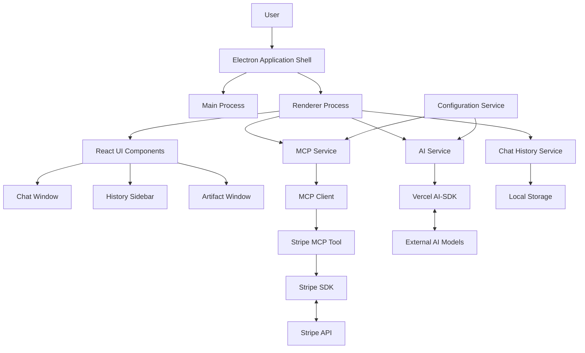
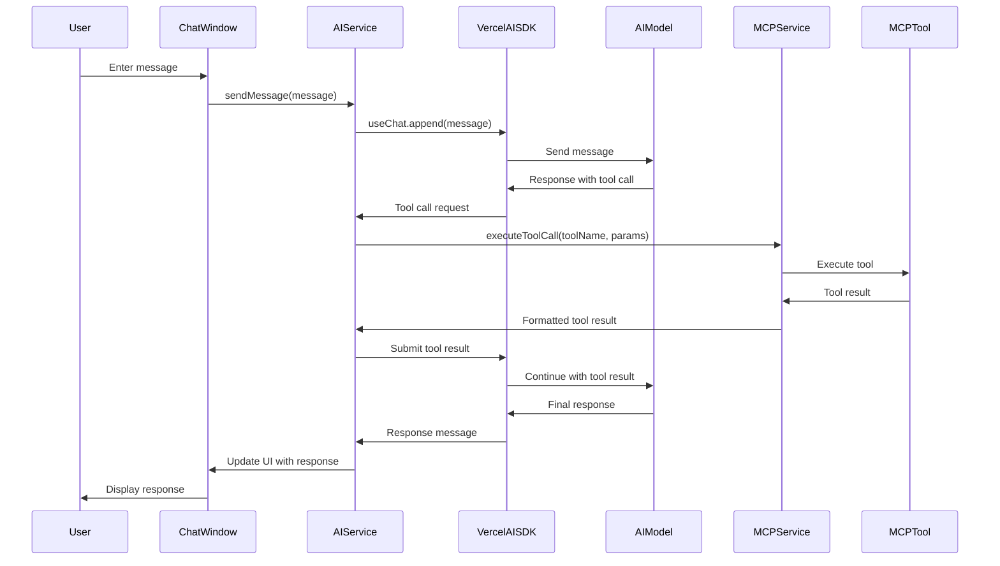
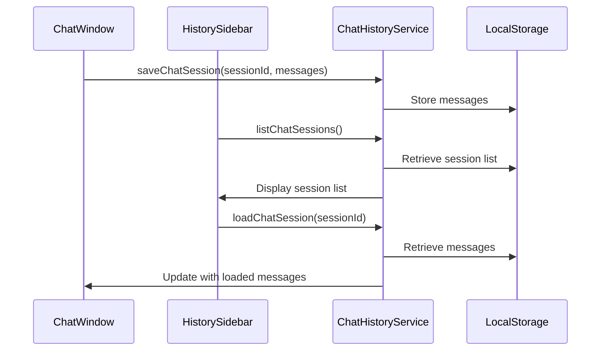
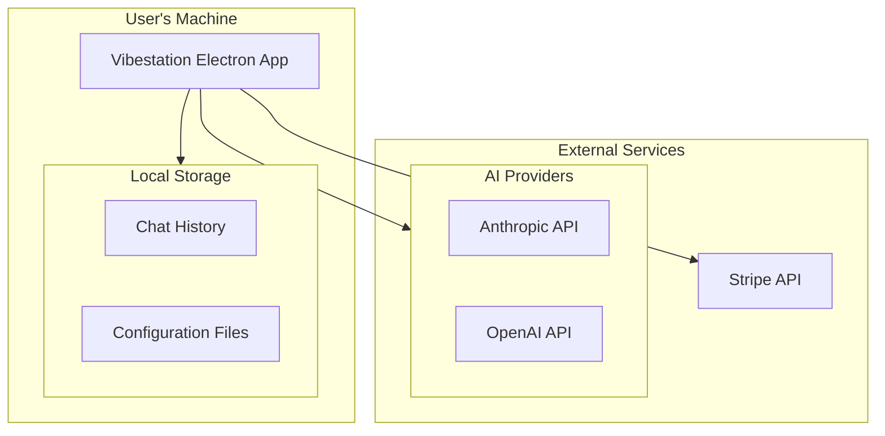

# Vibestation - System Architecture

## 1. System Overview

Vibestation is a desktop application that enables users to interact with AI models and utilize external tools (MCPs) to perform various tasks, including integration with third-party services like Stripe. The application is designed to run locally on a user's computer, providing a user-friendly interface for AI interaction while maintaining security for API keys and sensitive data.

## 2. Architecture Principles

The architecture for Vibestation follows these key principles:

1. **Modularity**: Clear separation of concerns with well-defined component boundaries
2. **Security**: Secure handling of API keys and sensitive data
3. **Extensibility**: Easy integration of new MCP tools and AI models
4. **Testability**: Architecture designed to facilitate comprehensive unit testing
5. **User-centric**: Focus on delivering a seamless user experience

## 3. High-Level Architecture



## 4. Component Descriptions

### 4.1. Electron Application Shell

**Responsibility**: Provides the desktop application framework, manages window creation, and handles the lifecycle of the application.

**Interfaces**:
- Main Process: Handles system-level operations, window management, and IPC
- Renderer Process: Runs the React application and UI components

### 4.2. React UI Components with Chakra UI

**Responsibility**: Implements the user interface for the application using Chakra UI component library.

**Key Components**:
- **Chat Window**: Main interface for user-AI interaction, built with Chakra UI components
- **History Sidebar**: Displays and manages chat history, using Chakra UI's layout and navigation components
- **Artifact Window**: Displays HTML output from AI tools (e.g., Stripe payment links) in a sandboxed environment styled with Chakra UI

**UI Framework**:
- **Chakra UI**: Provides accessible, themeable components with built-in support for both light and dark modes
- **Custom Theme**: Extends Chakra UI's default theme for consistent application styling
- **Integration with Tailwind**: Chakra UI used for component structure while Tailwind provides additional styling capabilities

### 4.3. AI Service

**Responsibility**: Manages interactions with AI models via the Vercel AI-SDK.

**Key Functions**:
- Load AI provider configurations from `ai.config.json`
- Initialize and manage chat sessions
- Format messages for AI models
- Process responses from AI models
- Handle tool calling requests

**Interfaces**:
- `initializeAI(config)`: Initialize AI service with configuration
- `sendMessage(message)`: Send a user message to the AI
- `processTool(toolCall)`: Process a tool call from the AI

### 4.4. MCP Service

**Responsibility**: Manages MCP servers and tools via the `mcp-client` library.

**Key Functions**:
- Load MCP configurations from `mcp.config.json`
- Initialize and manage MCP servers
- Format tool definitions for Vercel AI-SDK
- Dispatch tool calls to appropriate MCP tools
- Format tool results for the AI

**Interfaces**:
- `initializeMCP(config)`: Initialize MCP service with configuration
- `getToolDefinitions()`: Get tool definitions in AI-SDK compatible format
- `executeToolCall(toolName, params)`: Execute a tool call

### 4.5. Stripe MCP Tool

**Responsibility**: Provides Stripe functionality as an MCP tool.

**Key Functions**:
- List recent payments
- Check account balance
- Create payment links
- Securely manage Stripe API keys

**Interfaces**:
- `listRecentPayments()`: List recent payments
- `checkBalance()`: Check Stripe account balance
- `createPaymentLink(params)`: Create a payment link

### 4.6. Chat History Service

**Responsibility**: Manages local storage of chat history.

**Key Functions**:
- Save chat sessions
- Load chat sessions
- List available chat sessions

**Interfaces**:
- `saveChatSession(sessionId, messages)`: Save a chat session
- `loadChatSession(sessionId)`: Load a chat session
- `listChatSessions()`: List available chat sessions

### 4.7. Configuration Service

**Responsibility**: Manages application configuration.

**Key Functions**:
- Load and parse configuration files
- Validate configuration
- Provide configuration to other services

**Interfaces**:
- `loadAIConfig()`: Load AI configuration
- `loadMCPConfig()`: Load MCP configuration

## 5. Data Flow

### 5.1. Chat Interaction Flow



### 5.2. Chat History Flow



## 6. Key Interfaces

### 6.1. Electron IPC Interface

The Main and Renderer processes communicate via IPC channels:

```typescript
// Main Process
ipcMain.handle('load-config', async (event, configType) => {
  // Load configuration files
  return configData;
});

// Renderer Process
const configData = await ipcRenderer.invoke('load-config', 'ai');
```

### 6.2. AI Service Interface

```typescript
interface AIService {
  initializeAI(config: AIConfig): Promise<void>;
  sendMessage(message: string): Promise<void>;
  processTool(toolCall: ToolCall): Promise<ToolResult>;
  getMessages(): Message[];
}

interface AIConfig {
  provider: 'anthropic' | 'openai';
  model: string;
  apiKey: string;
  // Other provider-specific options
}

interface Message {
  role: 'user' | 'assistant';
  content: string;
  toolCalls?: ToolCall[];
}

interface ToolCall {
  id: string;
  name: string;
  arguments: Record<string, any>;
}

interface ToolResult {
  callId: string;
  result: any;
}
```

### 6.3. MCP Service Interface

```typescript
interface MCPService {
  initializeMCP(config: MCPConfig): Promise<void>;
  getToolDefinitions(): ToolDefinition[];
  executeToolCall(toolName: string, params: Record<string, any>): Promise<any>;
}

interface MCPConfig {
  servers: MCPServer[];
  tools: MCPTool[];
}

interface MCPServer {
  type: 'stdio' | 'sse';
  path?: string; // For local STDIO servers
  url?: string;  // For remote SSE servers
  tools: string[]; // Tool names available on this server
}

interface MCPTool {
  name: string;
  description: string;
  actions: MCPAction[];
}

interface MCPAction {
  name: string;
  description: string;
  parameters: Record<string, any>;
  returnSchema: any;
}

interface ToolDefinition {
  type: 'function';
  function: {
    name: string;
    description: string;
    parameters: {
      type: 'object';
      properties: Record<string, any>;
      required: string[];
    };
  };
}
```

### 6.4. Chat History Service Interface

```typescript
interface ChatHistoryService {
  saveChatSession(sessionId: string, messages: Message[]): Promise<void>;
  loadChatSession(sessionId: string): Promise<Message[]>;
  listChatSessions(): Promise<ChatSession[]>;
}

interface ChatSession {
  id: string;
  title: string;
  timestamp: number;
  previewText: string; // First few characters of the first message
}
```

## 7. Security Considerations

### 7.1. API Key Management

API keys for external services (AI providers, Stripe) must be securely stored. Options include:

1. **OS Keychain Integration**: Store sensitive keys in the OS keychain
2. **Environment Variables**: Load keys from environment variables
3. **Encrypted Local Storage**: Encrypt keys before storing locally

The architecture supports configurable API key storage, defaulting to the most secure option available on the user's platform.

### 7.2. MCP Tool Security

MCP tools, particularly those interacting with external services like Stripe, must implement:

1. **Least Privilege**: Tools should request only the permissions they need
2. **Input Validation**: Validate all inputs to prevent injection attacks
3. **Rate Limiting**: Prevent abuse by limiting API calls
4. **Audit Logging**: Log all sensitive operations for security review

### 7.3. Artifact Window Security

The Artifact Window displays HTML content from tool results. To prevent security issues:

1. **Sandboxed Rendering**: Use sandboxed iframes or webviews
2. **Content Security Policy**: Implement strict CSP rules
3. **Limited JavaScript Execution**: Disable or restrict JavaScript execution

## 8. Configuration

The application uses two primary configuration files:

### 8.1. AI Configuration (`ai.config.json`)

```json
{
  "providers": {
    "anthropic": {
      "apiKey": "${ANTHROPIC_API_KEY}",
      "models": {
        "default": "claude-3-sonnet-20240229",
        "available": [
          "claude-3-sonnet-20240229",
          "claude-3-opus-20240229"
        ]
      }
    },
    "openai": {
      "apiKey": "${OPENAI_API_KEY}",
      "models": {
        "default": "gpt-4o",
        "available": [
          "gpt-4o",
          "gpt-4-turbo"
        ]
      }
    },
    "default": "anthropic"
  }
}
```

### 8.2. MCP Configuration (`mcp.config.json`)

```json
{
  "servers": [
    {
      "type": "stdio",
      "path": "./mcp_servers/stripe_server.js",
      "tools": ["stripe"]
    }
  ],
  "tools": {
    "stripe": {
      "apiKey": "${STRIPE_API_KEY}",
      "actions": ["listRecentPayments", "checkBalance", "createPaymentLink"]
    }
  }
}
```

## 9. Deployment View



## 10. Extension Points

The architecture includes several extension points for future development:

1. **Additional MCP Tools**: New tools can be added by creating new MCP tool modules and updating the configuration.
2. **Additional AI Providers**: Support for new AI providers can be added by extending the AI service.
3. **UI Customization**: The React UI components can be extended or replaced for different use cases.
4. **"Vibes" (Modes)**: Future versions can implement specialized modes with pre-configured tools, models, and prompts.
5. **Context Management**: Advanced context management techniques can be integrated with the existing chat system.

## 11. Testing Strategy

The architecture is designed to facilitate comprehensive unit testing:

1. **Component Isolation**: Clear interfaces between components allow for effective mocking and isolation in tests.
2. **Dependency Injection**: Services accept configuration and dependencies, making them easier to test.
3. **Pure Functions**: Core business logic is implemented as pure functions where possible for deterministic testing.

## 12. Architecture Decisions and Rationale

### 12.1. Electron as the Application Framework
**Decision**: Use Electron for the desktop application.
**Rationale**: Electron provides cross-platform compatibility, access to native features, and the ability to use web technologies for UI development.

### 12.2. Vercel AI-SDK for AI Model Integration
**Decision**: Use Vercel AI-SDK for AI model integration.
**Rationale**: Vercel AI-SDK provides a consistent interface for multiple AI providers and integrated support for tool calling.

### 12.3. MCP Client for Tool Management
**Decision**: Use `mcp-client` for MCP server and tool management.
**Rationale**: `mcp-client` provides a standardized way to work with local and remote MCP servers and tools.

### 12.4. Configuration-Driven Architecture
**Decision**: Use configuration files for AI and MCP settings.
**Rationale**: Configuration-driven design allows for flexibility and easy customization without code changes.

### 12.5. React for UI Development
**Decision**: Use React for UI development.
**Rationale**: React provides component-based architecture, performance optimization, and good TypeScript integration.

## 13. Glossary

- **MCP**: Model-Controller-Presenter, referring to AI tool-calling capabilities
- **AI-SDK**: Artificial Intelligence Software Development Kit (Vercel AI-SDK)
- **Tool Calling**: AI models requesting execution of specific functions
- **Electron**: Cross-platform desktop application framework
- **Renderer Process**: The process in Electron that renders the UI
- **Main Process**: The background process in Electron that has access to Node.js APIs
- **API Key**: Authentication credential for accessing external services