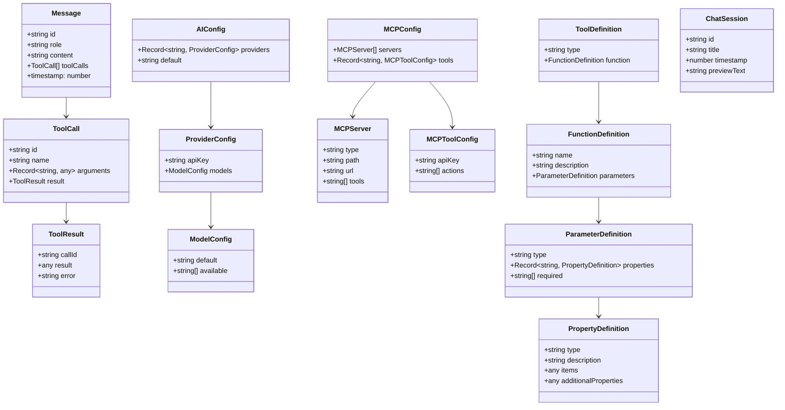
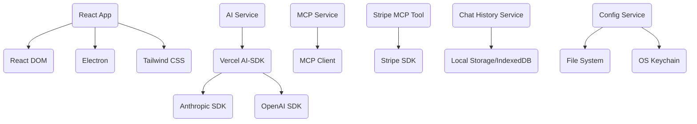
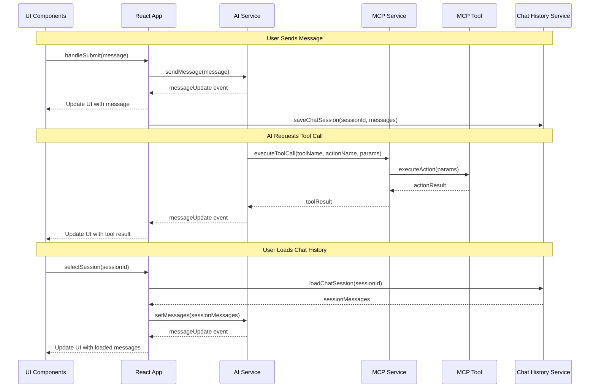
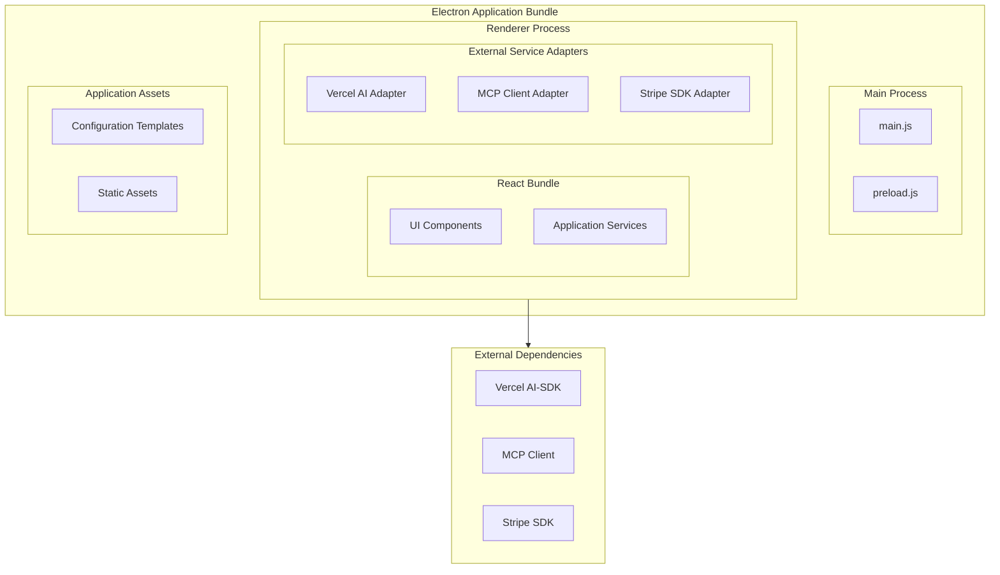

# Vibestation - Detailed Component Diagram

This document provides a detailed view of the Vibestation system components, focusing on their internal structure, interfaces, and interactions.

## 1. Component Interaction Diagram

```mermaid
classDiagram
    class ElectronShell {
        -createMainWindow()
        -registerIPCHandlers()
        +launchApplication()
    }
    
    class MainProcess {
        -configureApp()
        -handleIPCEvents()
        +loadConfiguration(configType)
        +createWindow()
    }
    
    class RendererProcess {
        -initializeServices()
        -renderUI()
        +invokeIPC(channel, args)
    }
    
    class ReactApp {
        -state: AppState
        -initializeApp()
        +render()
    }
    
    class ChatWindow {
        -messages: Message[]
        -inputValue: string
        -isLoading: boolean
        +handleInputChange(value)
        +handleSubmit()
        +renderMessages()
    }
    
    class HistorySidebar {
        -sessions: ChatSession[]
        -selectedSessionId: string
        +loadSessions()
        +selectSession(sessionId)
        +createNewSession()
    }
    
    class ArtifactWindow {
        -htmlContent: string
        -isSandboxed: boolean
        +renderHTML(content)
        +clearContent()
    }
    
    class AIService {
        -config: AIConfig
        -vercelAI: VercelAI
        -messages: Message[]
        +initializeAI(config)
        +sendMessage(message)
        +processTool(toolCall)
        +getMessages()
    }
    
    class VercelAIAdapter {
        -provider: string
        -model: string
        -apiKey: string
        +useChat(options)
        +createToolDefinition(tool)
    }
    
    class MCPService {
        -config: MCPConfig
        -mcpClient: MCPClient
        -toolDefinitions: ToolDefinition[]
        +initializeMCP(config)
        +getToolDefinitions()
        +executeToolCall(toolName, params)
    }
    
    class MCPClient {
        -servers: MCPServer[]
        -tools: MCPTool[]
        +startServer(server)
        +stopServer(server)
        +callTool(toolName, action, params)
    }
    
    class StripeTool {
        -stripe: Stripe
        -apiKey: string
        +initialize(apiKey)
        +listRecentPayments()
        +checkBalance()
        +createPaymentLink(params)
    }
    
    class ChatHistoryService {
        -storage: Storage
        +saveChatSession(sessionId, messages)
        +loadChatSession(sessionId)
        +listChatSessions()
        +deleteChatSession(sessionId)
    }
    
    class ConfigService {
        -configPath: string
        +loadAIConfig()
        +loadMCPConfig()
        +validateConfig(config, schema)
    }
    
    ElectronShell --> MainProcess
    ElectronShell --> RendererProcess
    RendererProcess --> ReactApp
    ReactApp --> ChatWindow
    ReactApp --> HistorySidebar
    ReactApp --> ArtifactWindow
    ReactApp --> AIService
    ReactApp --> MCPService
    ReactApp --> ChatHistoryService
    ReactApp --> ConfigService
    AIService --> VercelAIAdapter
    MCPService --> MCPClient
    MCPClient --> StripeTool
    ChatWindow --> AIService
    HistorySidebar --> ChatHistoryService
    AIService --> MCPService : Tool calls
    ConfigService --> AIService : Provides config
    ConfigService --> MCPService : Provides config
    StripeTool --> "External Stripe API" : API calls
    VercelAIAdapter --> "External AI Models" : API calls
```

## 2. Key Interfaces

### 2.1. AIService Interface

```typescript
interface AIService {
  /**
   * Initialize the AI service with the provided configuration
   * @param config The AI configuration
   */
  initializeAI(config: AIConfig): Promise<void>;
  
  /**
   * Send a user message to the AI and process the response
   * @param message The user message
   */
  sendMessage(message: string): Promise<void>;
  
  /**
   * Process a tool call from the AI
   * @param toolCall The tool call request
   * @returns The result of the tool call
   */
  processTool(toolCall: ToolCall): Promise<ToolResult>;
  
  /**
   * Get the current chat messages
   * @returns Array of messages
   */
  getMessages(): Message[];
  
  /**
   * Add a listener for message updates
   * @param listener The listener function
   */
  addMessageListener(listener: (messages: Message[]) => void): void;
  
  /**
   * Remove a message listener
   * @param listener The listener to remove
   */
  removeMessageListener(listener: (messages: Message[]) => void): void;
}
```

### 2.2. MCPService Interface

```typescript
interface MCPService {
  /**
   * Initialize the MCP service with the provided configuration
   * @param config The MCP configuration
   */
  initializeMCP(config: MCPConfig): Promise<void>;
  
  /**
   * Get tool definitions in a format compatible with the Vercel AI-SDK
   * @returns Array of tool definitions
   */
  getToolDefinitions(): ToolDefinition[];
  
  /**
   * Execute a tool call
   * @param toolName The name of the tool
   * @param actionName The name of the tool action
   * @param params The parameters for the tool call
   * @returns The result of the tool call
   */
  executeToolCall(
    toolName: string, 
    actionName: string, 
    params: Record<string, any>
  ): Promise<any>;
  
  /**
   * Add a tool dynamically
   * @param tool The tool to add
   */
  addTool(tool: MCPTool): void;
  
  /**
   * Remove a tool
   * @param toolName The name of the tool to remove
   */
  removeTool(toolName: string): void;
}
```

### 2.3. StripeTool Interface

```typescript
interface StripeTool {
  /**
   * Initialize the Stripe tool with the provided API key
   * @param apiKey The Stripe API key
   */
  initialize(apiKey: string): Promise<void>;
  
  /**
   * List recent payments
   * @param limit Optional limit parameter
   * @returns List of recent payments
   */
  listRecentPayments(limit?: number): Promise<StripePayment[]>;
  
  /**
   * Check the account balance
   * @returns Account balance information
   */
  checkBalance(): Promise<StripeBalance>;
  
  /**
   * Create a payment link
   * @param params Parameters for the payment link
   * @returns Created payment link
   */
  createPaymentLink(params: PaymentLinkParams): Promise<PaymentLink>;
}

interface StripePayment {
  id: string;
  amount: number;
  currency: string;
  status: string;
  created: number;
  description?: string;
}

interface StripeBalance {
  available: BalanceAmount[];
  pending: BalanceAmount[];
}

interface BalanceAmount {
  amount: number;
  currency: string;
}

interface PaymentLinkParams {
  amount: number;
  currency: string;
  description?: string;
  lineItems?: LineItem[];
}

interface PaymentLink {
  id: string;
  url: string;
  created: number;
  active: boolean;
}

interface LineItem {
  name: string;
  amount: number;
  quantity: number;
}
```

### 2.4. ChatHistoryService Interface

```typescript
interface ChatHistoryService {
  /**
   * Save a chat session
   * @param sessionId The session ID
   * @param messages The messages to save
   */
  saveChatSession(sessionId: string, messages: Message[]): Promise<void>;
  
  /**
   * Load a chat session
   * @param sessionId The session ID
   * @returns The messages for the session
   */
  loadChatSession(sessionId: string): Promise<Message[]>;
  
  /**
   * List available chat sessions
   * @returns Array of chat session metadata
   */
  listChatSessions(): Promise<ChatSession[]>;
  
  /**
   * Delete a chat session
   * @param sessionId The session ID to delete
   */
  deleteChatSession(sessionId: string): Promise<void>;
  
  /**
   * Create a new chat session
   * @returns The new session ID
   */
  createChatSession(): Promise<string>;
}

interface ChatSession {
  id: string;
  title: string;
  timestamp: number;
  previewText: string;
}
```

### 2.5. ConfigService Interface

```typescript
interface ConfigService {
  /**
   * Load the AI configuration
   * @returns The AI configuration
   */
  loadAIConfig(): Promise<AIConfig>;
  
  /**
   * Load the MCP configuration
   * @returns The MCP configuration
   */
  loadMCPConfig(): Promise<MCPConfig>;
  
  /**
   * Validate a configuration against a schema
   * @param config The configuration to validate
   * @param schema The validation schema
   * @returns Whether the configuration is valid
   */
  validateConfig(config: any, schema: any): boolean;
  
  /**
   * Save a configuration
   * @param configType The type of configuration
   * @param config The configuration to save
   */
  saveConfig(configType: 'ai' | 'mcp', config: any): Promise<void>;
  
  /**
   * Get the secure storage for API keys
   * @returns The secure storage interface
   */
  getSecureStorage(): SecureStorage;
}

interface SecureStorage {
  /**
   * Get a stored API key
   * @param key The key to retrieve
   * @returns The stored value
   */
  getKey(key: string): Promise<string | null>;
  
  /**
   * Store an API key
   * @param key The key to store
   * @param value The value to store
   */
  setKey(key: string, value: string): Promise<void>;
  
  /**
   * Delete a stored API key
   * @param key The key to delete
   */
  deleteKey(key: string): Promise<void>;
}
```

## 3. Data Model



## 4. Component Dependencies



## 5. Event Flow

The Vibestation application uses an event-driven architecture for many of its interactions. Below is a diagram of the key event flows:



## 6. Deployment Component View

This diagram shows how the various components are packaged and deployed:



## 7. Security Boundaries

```mermaid
flowchart TD
    subgraph TrustedZone["Trusted Zone (Main Process)"]
        MainProcess["Main Process"]
        FileAccess["File System Access"]
        APIKeyStorage["API Key Storage"]
    end
    
    subgraph RestrictedZone["Restricted Zone (Renderer Process)"]
        RendererProcess["Renderer Process"]
        UIComponents["UI Components"]
        Services["Application Services"]
    end
    
    subgraph IsolatedZone["Isolated Zone (Sandboxed Content)"]
        ArtifactWindow["Artifact Window HTML Renderer"]
    end
    
    subgraph ExternalZone["External Zone"]
        AIProviders["AI Providers"]
        StripeAPI["Stripe API"]
    end
    
    MainProcess <--> RendererProcess: "IPC (Limited Channels)"
    RendererProcess --> ArtifactWindow: "Sandboxed Content Only"
    MainProcess --> FileAccess
    MainProcess --> APIKeyStorage
    RendererProcess --> ExternalZone: "HTTPS Only"
    
    classDef trusted fill:#bfd,stroke:#393
    classDef restricted fill:#fdb,stroke:#d73
    classDef isolated fill:#ddf,stroke:#33d
    classDef external fill:#fdd,stroke:#d33
    
    class TrustedZone trusted
    class RestrictedZone restricted
    class IsolatedZone isolated
    class ExternalZone external
```

## 8. Areas for Extensibility

```mermaid
graph TD
    Core[Core Application]
    
    subgraph AI_Models["AI Model Providers"]
        Anthropic[Anthropic]
        OpenAI[OpenAI]
        ExtensionPoint1[New AI Providers]
    end
    
    subgraph MCP_Tools["MCP Tools"]
        Stripe[Stripe Tool]
        ExtensionPoint2[New MCP Tools]
    end
    
    subgraph UI_Customization["UI Customization"]
        DefaultTheme[Default Theme]
        ExtensionPoint3[Custom Themes]
    end
    
    subgraph Modes["Modes/Vibes"]
        StandardMode[Standard Chat]
        ExtensionPoint4[Specialized Modes]
    end
    
    Core --> AI_Models
    Core --> MCP_Tools
    Core --> UI_Customization
    Core --> Modes
    
    classDef core fill:#ddf,stroke:#33d
    classDef existing fill:#bfd,stroke:#393
    classDef extension fill:#fdb,stroke:#d73
    
    class Core core
    class Anthropic,OpenAI,Stripe,DefaultTheme,StandardMode existing
    class ExtensionPoint1,ExtensionPoint2,ExtensionPoint3,ExtensionPoint4 extension