# Vibestation - Data Flow Diagrams

This document illustrates the key data flows within the Vibestation application, showing how information moves between components and external systems.

## 1. Core User Interaction Flow

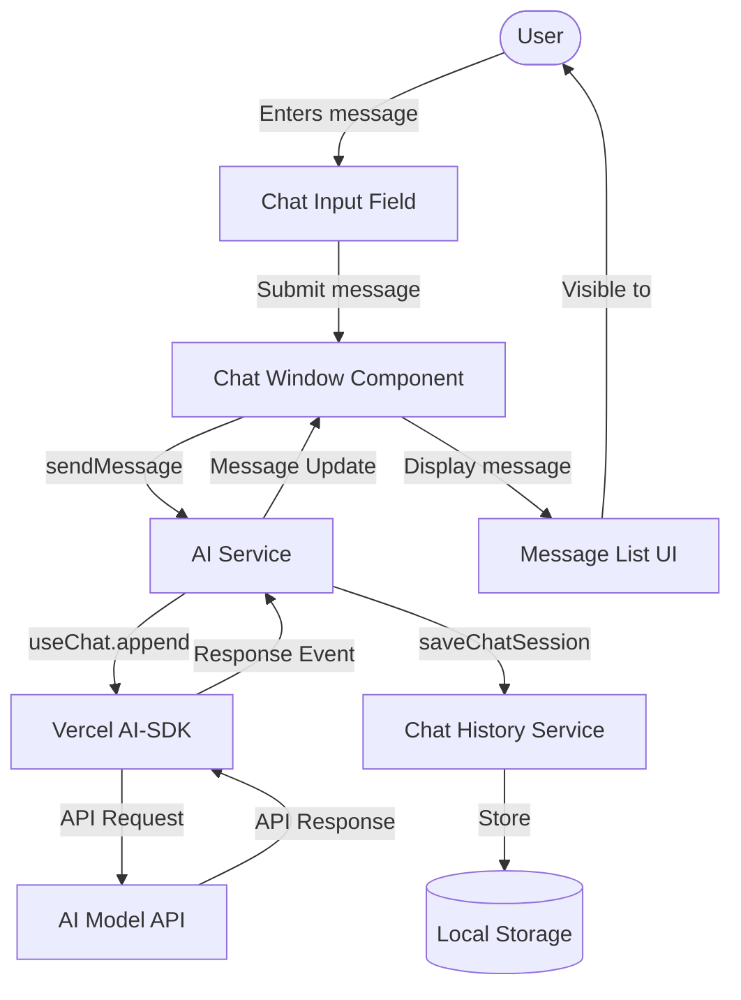

## 2. Tool Execution Flow

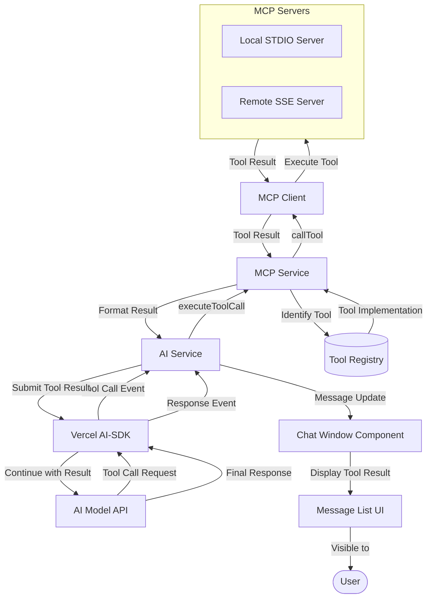

## 3. Stripe Tool Data Flow

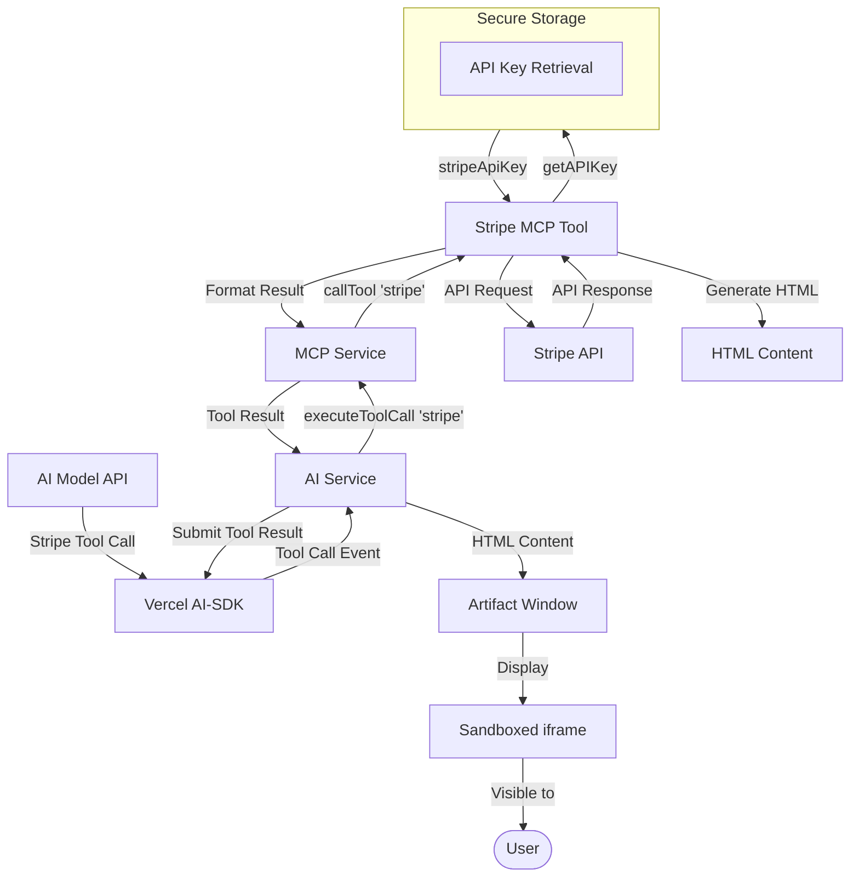

## 4. Chat History Data Flow

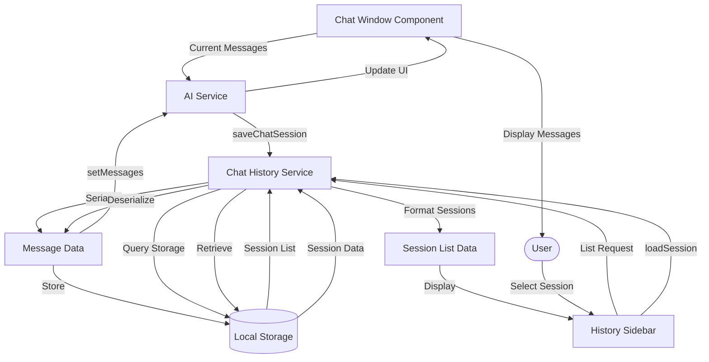

## 5. Configuration Data Flow

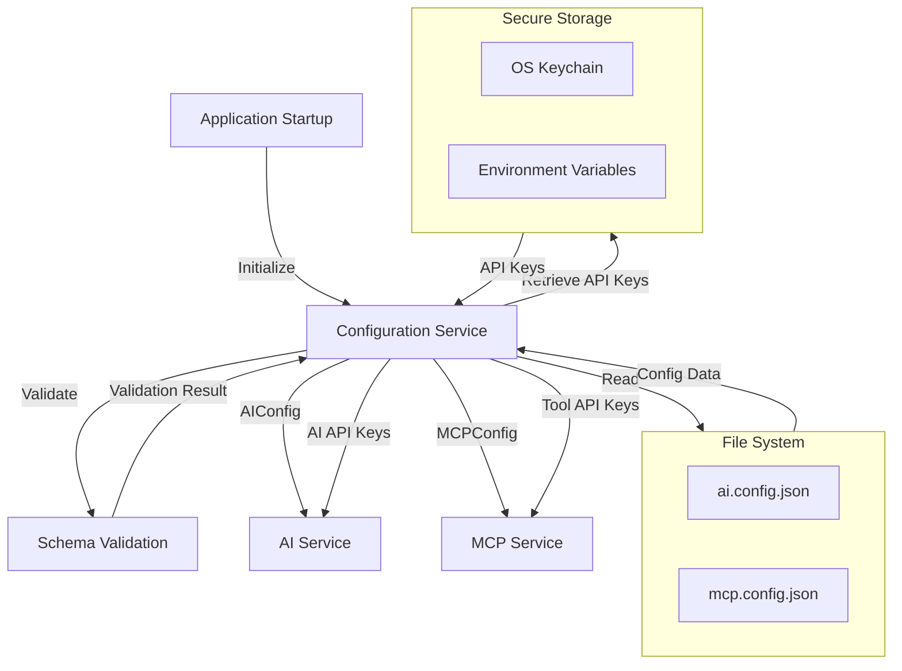

## 6. Electron IPC Data Flow

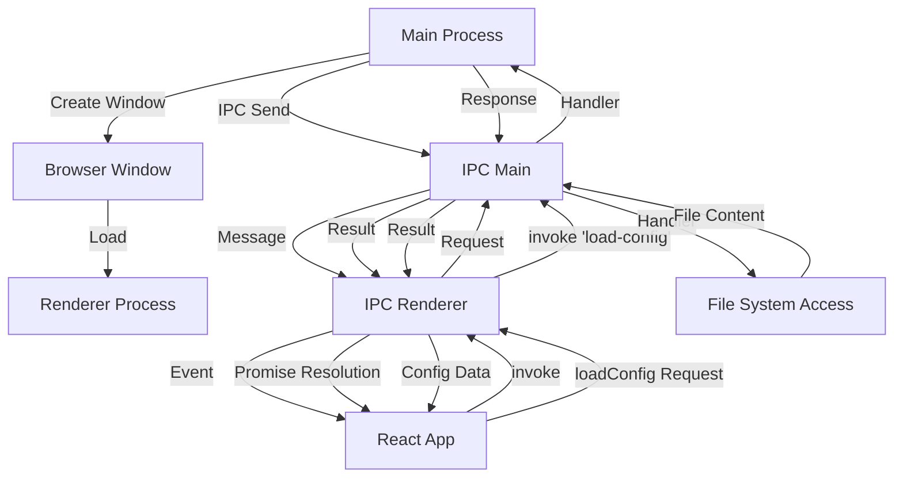

## 7. Artifact Window Security Flow

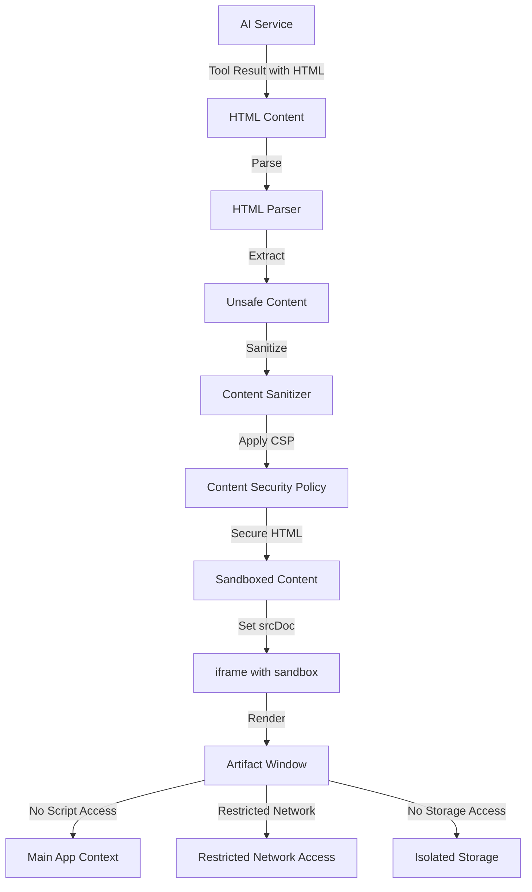

## 8. System State Transitions

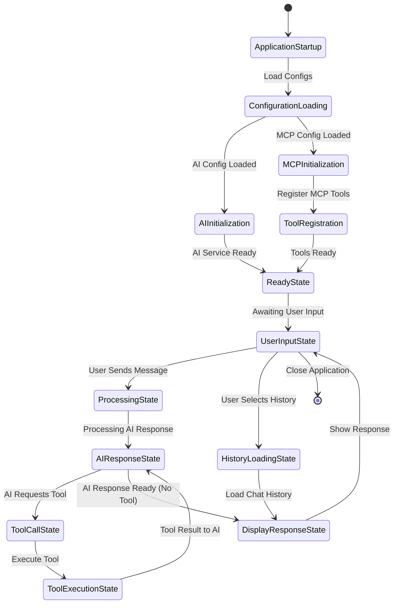

## 9. Error Handling Flow

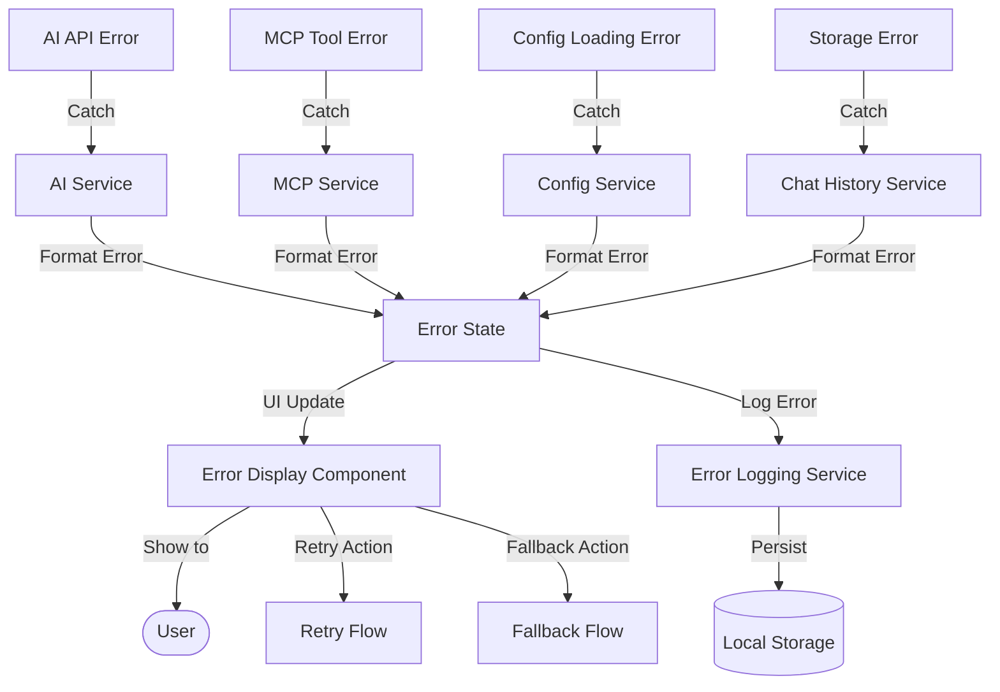

## 10. End-to-End Data Flow for a Complete User Interaction

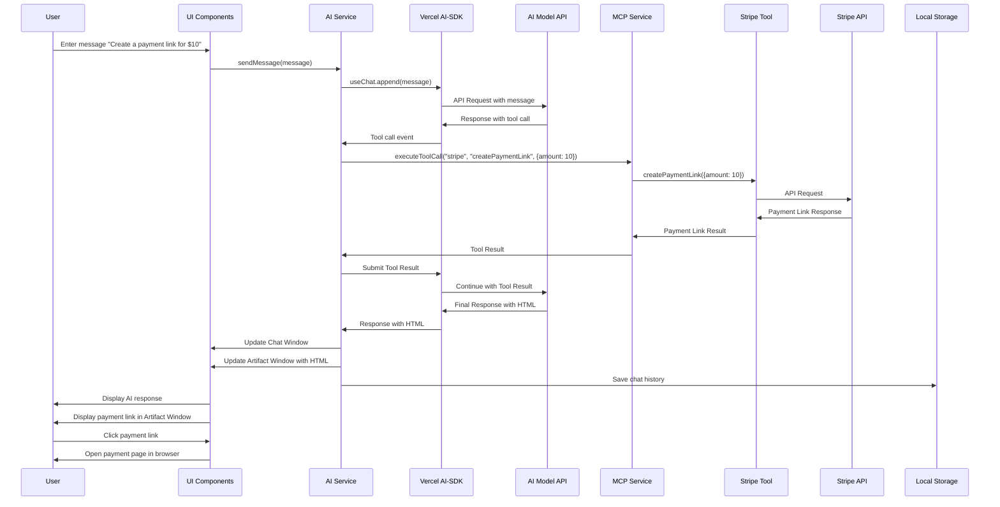

## 11. Data Storage Mapping

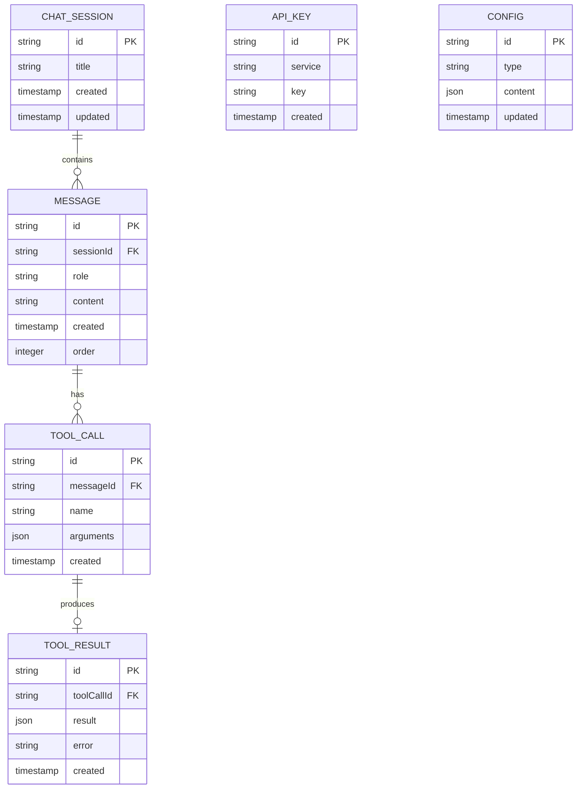

## 12. Secure Data Handling

```mermaid
flowchart TD
    %% Data Classification
    subgraph SensitiveData [Sensitive Data]
        direction TB
        AIApiKeys[AI API Keys]
        StripeApiKeys[Stripe API Keys]
        UserData[User Personal Data]
    end
    
    subgraph StandardData [Standard Data]
        direction TB
        ChatMessages[Chat Messages]
        ToolDefinitions[Tool Definitions]
        AppConfig[App Configuration]
    end
    
    %% Storage Mechanisms
    subgraph SecureStorage [Secure Storage]
        direction TB
        OSKeychain[OS Keychain]
        EnvVars[Environment Variables]
        EncryptedStore[Encrypted Local Store]
    end
    
    subgraph StandardStorage [Standard Storage]
        direction TB
        LocalStorage[Local Storage]
        ConfigFiles[Configuration Files]
    end
    
    %% Data Flow with Security Controls
    AIApiKeys -->|Secure Storage| OSKeychain
    StripeApiKeys -->|Secure Storage| OSKeychain
    UserData -->|Encrypted| EncryptedStore
    
    ChatMessages -->|Standard Storage| LocalStorage
    ToolDefinitions -->|Standard Storage| ConfigFiles
    AppConfig -->|Standard Storage| ConfigFiles
    
    %% Access Controls
    subgraph AccessControls [Access Controls]
        direction TB
        MainProcessOnly[Main Process Only]
        RendererProcessRestricted[Renderer Process Restricted]
    end
    
    SecureStorage -->|Limited Access| MainProcessOnly
    MainProcessOnly -->|Controlled IPC| RendererProcessRestricted
    StandardStorage -->|Direct Access| RendererProcessRestricted
    
    %% Security Boundaries
    classDef sensitive fill:#f9a,stroke:#a86
    classDef standard fill:#adf,stroke:#8ab
    classDef secure fill:#bfb,stroke:#8a8
    classDef standard_store fill:#ddf,stroke:#aac
    classDef access fill:#ffd,stroke:#cc8
    
    class SensitiveData sensitive
    class StandardData standard
    class SecureStorage secure
    class StandardStorage standard_store
    class AccessControls access