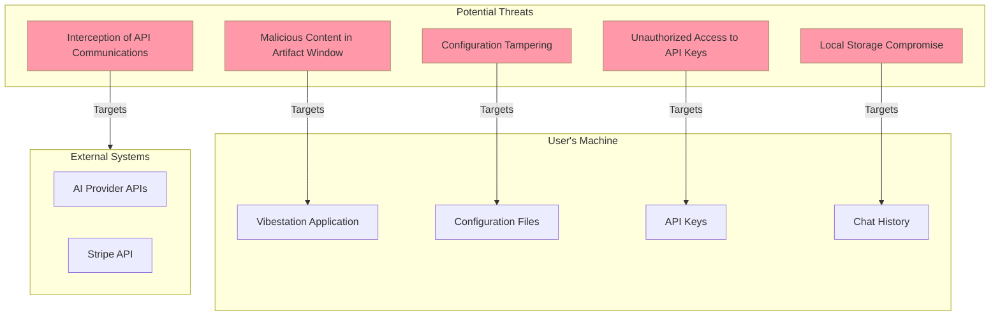
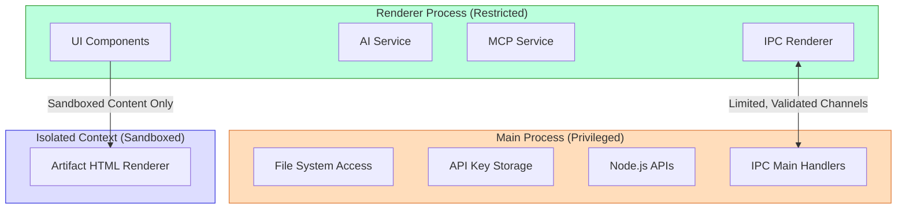
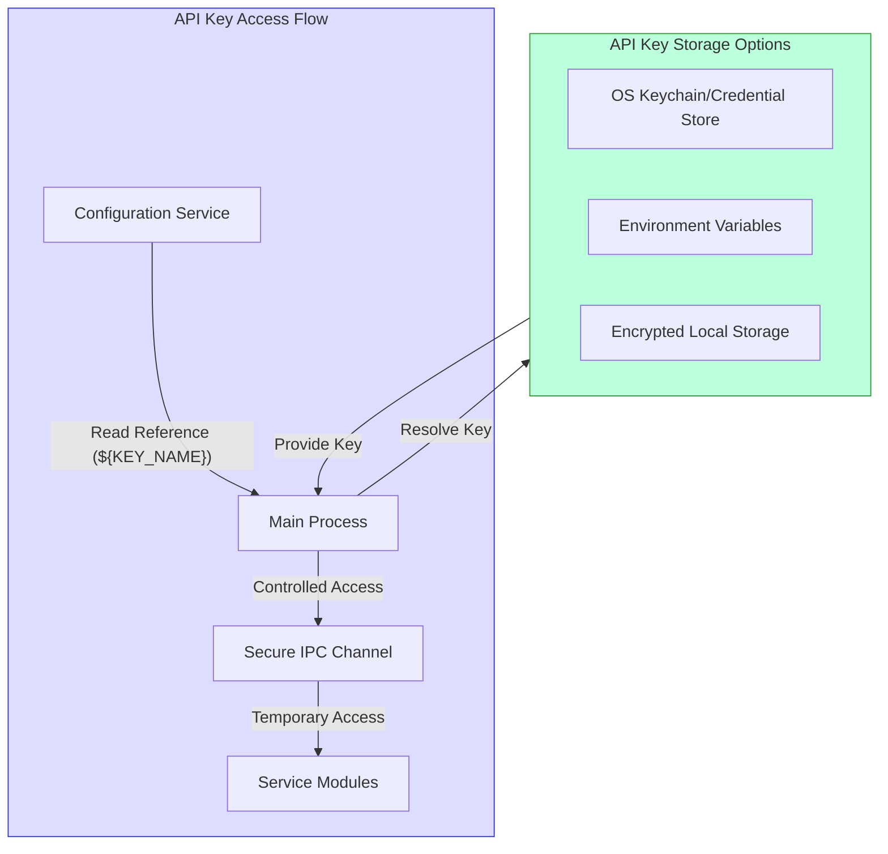
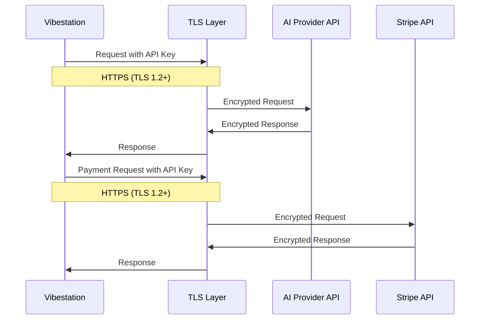
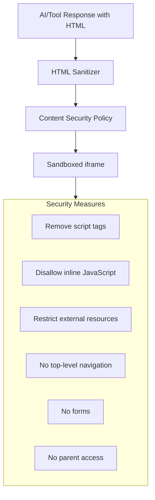
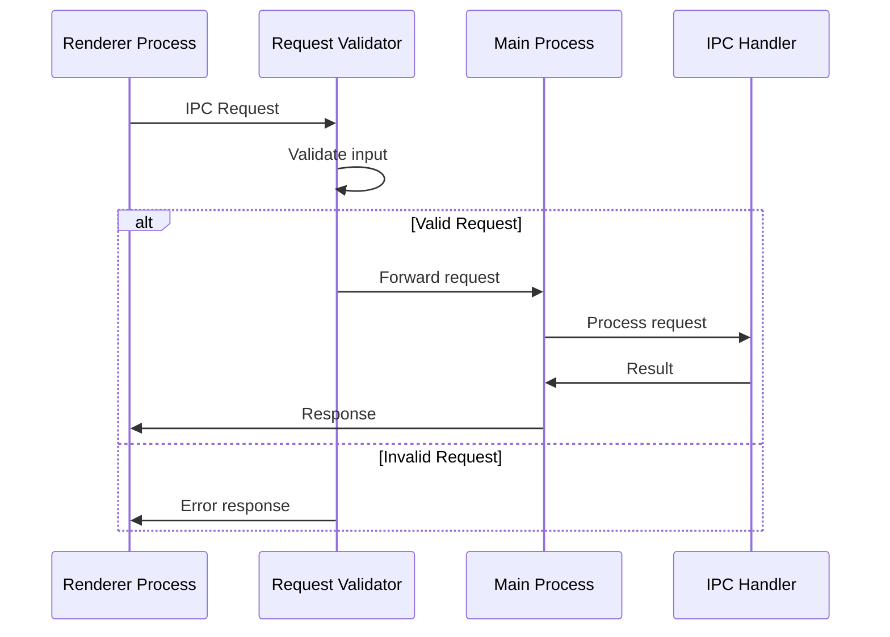
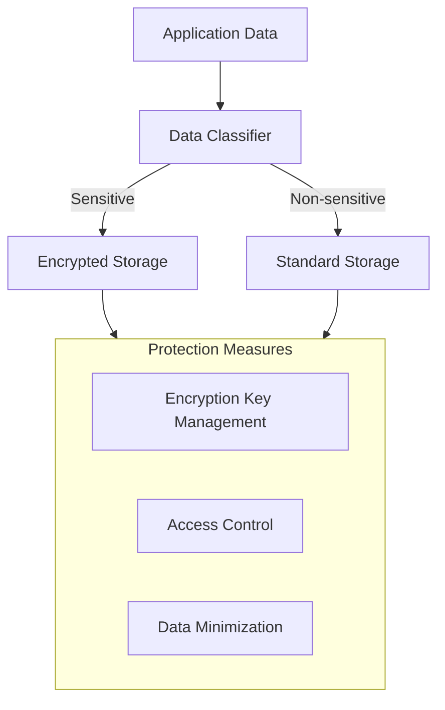
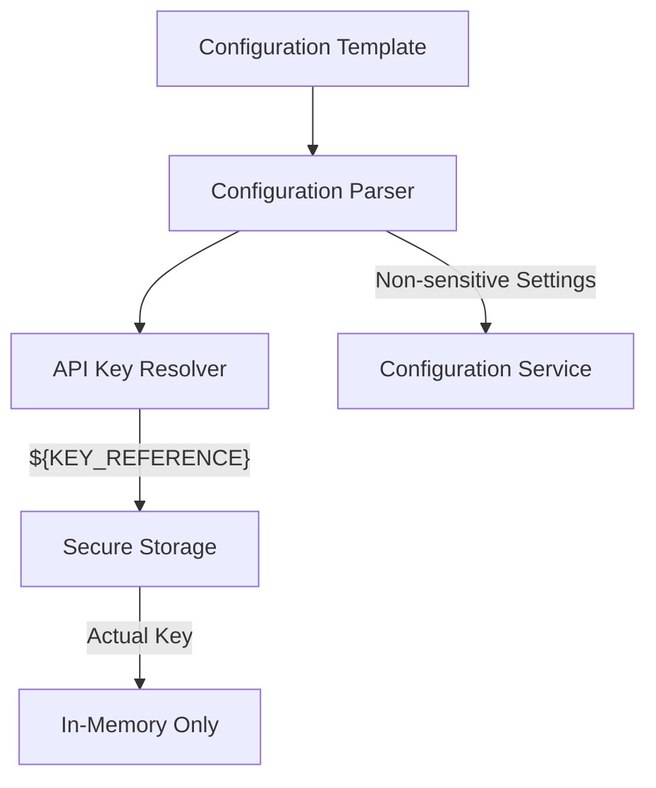
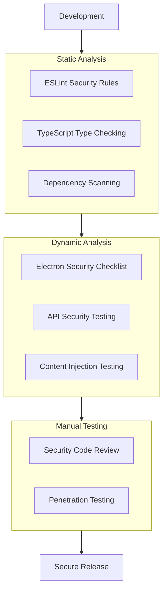

# Vibestation - Security Architecture

## 1. Overview

Security is a critical aspect of the Vibestation application, particularly because it handles sensitive information such as API keys for external services like AI providers and Stripe. This document outlines the security architecture, identifies potential security risks, and provides guidelines for implementing secure practices throughout the application.

## 2. Security Principles

The security architecture of Vibestation is built on the following core principles:

1. **Defense in Depth**: Multiple layers of security controls are implemented
2. **Principle of Least Privilege**: Components only have access to what they need
3. **Secure by Default**: Security is built into the design, not added as an afterthought
4. **Data Protection**: Sensitive data is encrypted and stored securely
5. **Transparent Security**: Security measures are documented and understandable

## 3. Threat Model



## 4. Security Architecture

### 4.1. Process Isolation and Security Boundaries

Electron applications run in two types of processes:

1. **Main Process**: Has full Node.js access and system privileges
2. **Renderer Process**: Runs web content and UI

Vibestation uses this architecture to create security boundaries:



### 4.2. API Key Management

API keys for external services (AI providers, Stripe) are highly sensitive and must be securely stored:



Recommended implementation:

1. **OS Keychain Integration** (Preferred):
   - Use `keytar` or similar libraries to integrate with the OS secure credential store
   - API keys never exist in plain text in configuration files

2. **Environment Variables** (Alternative):
   - Load API keys from environment variables
   - Configuration files reference environment variable names

3. **Encrypted Local Storage** (Fallback):
   - If OS keychain isn't available, use encrypted local storage
   - Derive encryption key from user-provided master password

### 4.3. Secure Communication

All communication with external services must be secured:



Secure communication guidelines:

1. **TLS Requirements**:
   - Enforce TLS 1.2 or higher for all API communications
   - Implement certificate validation
   - Consider certificate pinning for critical services

2. **Request/Response Security**:
   - Validate all API responses before processing
   - Implement proper error handling for failed requests
   - Avoid logging sensitive information from requests/responses

### 4.4. Artifact Window Sandboxing

The Artifact Window displays HTML content, which could potentially contain malicious code:



Implementation recommendations:

1. **Content Sanitization**:
   - Use libraries like DOMPurify to sanitize HTML
   - Remove all `<script>` tags and JavaScript event handlers
   - Filter out potentially dangerous HTML elements and attributes

2. **Sandbox Attributes**:
   - Use `sandbox` attribute on iframes with minimal permissions
   - Disable all permissions by default and only enable what's required
   - Example: `<iframe sandbox="allow-same-origin allow-popups"></iframe>`

3. **Content Security Policy (CSP)**:
   - Apply strict CSP to control what content can be loaded
   - Disallow inline scripts and restrict external resource loading
   - Example: `default-src 'self'; script-src 'none'; object-src 'none'`

### 4.5. Inter-Process Communication (IPC) Security

Communication between Main and Renderer processes must be controlled:



IPC security guidelines:

1. **Explicit Channel Definition**:
   - Define specific IPC channels for each functionality
   - Document each channel's purpose and expected data format

2. **Input Validation**:
   - Validate all data received through IPC channels
   - Use strong typing (TypeScript) for IPC message payloads

3. **Principle of Least Privilege**:
   - Only expose necessary functionality through IPC
   - Implement access controls for sensitive operations

4. **Context Isolation**:
   - Enable contextIsolation in Electron webPreferences
   - Use a preload script to expose only specific APIs

### 4.6. Local Storage Security

Chat history and application data are stored locally:



Local storage security recommendations:

1. **Data Classification**:
   - Classify all stored data as sensitive or non-sensitive
   - Apply appropriate security controls based on classification

2. **Encryption**:
   - Encrypt sensitive data before storage
   - Use strong, industry-standard encryption algorithms (AES-256)
   - Derive encryption keys from user master password or OS secure storage

3. **Access Control**:
   - Implement access controls for stored data
   - Restrict direct access from renderer process
   - Use IPC for controlled access to sensitive data

4. **Data Minimization**:
   - Only store necessary data
   - Implement retention policies for chat history
   - Provide option to clear sensitive data

### 4.7. Configuration Security

Configuration files may contain sensitive settings:



Configuration security guidelines:

1. **Sensitive Data References**:
   - Never store actual API keys in configuration files
   - Use reference syntax (e.g., `${KEY_NAME}`) in config files
   - Resolve references at runtime from secure storage

2. **Configuration Validation**:
   - Validate configuration file structure and values
   - Implement schema validation for configuration files
   - Handle invalid configurations securely

3. **Secure Defaults**:
   - Provide secure default values for all settings
   - Fail closed (deny by default) for security settings

## 5. Security Controls by Component

| Component | Security Controls | Threats Addressed |
|-----------|-------------------|-------------------|
| **Main Process** | Limited IPC exposure, Input validation | Unauthorized access to system resources |
| **Renderer Process** | contextIsolation, sandboxing | XSS, prototype pollution |
| **API Key Storage** | OS keychain integration, encryption | API key theft |
| **AI Service** | TLS, request validation | Data interception, API abuse |
| **MCP Service** | Tool validation, action restrictions | Unauthorized tool access |
| **Stripe Tool** | Input validation, restricted operations | Financial fraud |
| **Artifact Window** | Content sanitization, CSP, sandbox | XSS, content injection |
| **Chat History** | Encryption, access control | Data privacy breach |
| **Configuration** | Reference-only sensitive data, validation | Configuration tampering |

## 6. Security Verification

### 6.1. Security Testing Strategy



Recommended security verification approach:

1. **Static Analysis**:
   - Implement security-focused ESLint rules
   - Use TypeScript for type safety
   - Scan dependencies for known vulnerabilities

2. **Dynamic Analysis**:
   - Test with Electron security checklist
   - Verify secure API communications
   - Test content injection in artifact window

3. **Manual Testing**:
   - Conduct security-focused code reviews
   - Perform targeted penetration testing
   - Review sensitive data handling

### 6.2. Security Checklist

**Electron Security**:
- [ ] contextIsolation enabled
- [ ] nodeIntegration disabled
- [ ] Proper use of preload scripts
- [ ] sandbox enabled where appropriate
- [ ] webSecurity enabled
- [ ] Latest Electron version with security fixes

**API Security**:
- [ ] TLS 1.2+ enforced
- [ ] Certificate validation implemented
- [ ] API keys securely stored
- [ ] Request/response validation

**Content Security**:
- [ ] HTML content sanitization
- [ ] Strict CSP implemented
- [ ] iframe sandbox attributes
- [ ] XSS protection measures

**Data Security**:
- [ ] Sensitive data encrypted at rest
- [ ] Secure data in transit
- [ ] Data minimization practices
- [ ] Proper error handling that doesn't leak information

## 7. Incident Response Plan

In the event of a security incident:

1. **Identification**:
   - Monitor for unusual behavior
   - Log security-relevant events
   - Enable users to report security issues

2. **Containment**:
   - Implement ability to revoke API keys
   - Provide clear user guidance for security issues
   - Plan for security updates/patches

3. **Recovery**:
   - Document steps to secure compromised installations
   - Provide mechanisms to reset to secure state
   - Ensure clean recovery from security incidents

## 8. Security Recommendations For Implementation

### 8.1. API Key Management

```typescript
// Example of secure API key handling pattern
class SecureKeyManager {
  private async getKeyFromSecureStorage(keyName: string): Promise<string> {
    // Delegate to OS-specific secure storage
    try {
      // Try OS keychain first (preferred)
      const keytar = require('keytar');
      const key = await keytar.getPassword('vibestation', keyName);
      if (key) return key;
      
      // Fall back to environment variables
      const envKey = process.env[keyName];
      if (envKey) return envKey;
      
      // Last resort - prompt user (in main process)
      // ...
      
      throw new Error(`Could not retrieve key: ${keyName}`);
    } catch (error) {
      console.error('Error retrieving API key:', error);
      throw new Error('Failed to access secure storage');
    }
  }
  
  public async resolveConfigValues(config: any): Promise<any> {
    const resolvedConfig = { ...config };
    
    // Process config recursively to find key references
    const processObject = async (obj: any) => {
      for (const key in obj) {
        if (typeof obj[key] === 'string' && obj[key].startsWith('${') && obj[key].endsWith('}')) {
          // Extract key name from ${KEY_NAME}
          const keyName = obj[key].substring(2, obj[key].length - 1);
          // Replace with actual key from secure storage
          obj[key] = await this.getKeyFromSecureStorage(keyName);
        } else if (typeof obj[key] === 'object' && obj[key] !== null) {
          await processObject(obj[key]);
        }
      }
    };
    
    await processObject(resolvedConfig);
    return resolvedConfig;
  }
}
```

### 8.2. Secure IPC Pattern

```typescript
// Main process
import { ipcMain } from 'electron';
import { validateIPCRequest } from './validators';

// Define allowed IPC channels
const allowedChannels = {
  'load-config': {
    validator: (args: any) => typeof args === 'string' && ['ai', 'mcp'].includes(args),
    handler: async (configType: string) => {
      // Implementation
    }
  },
  'execute-tool': {
    validator: (args: any) => {
      return args && 
        typeof args.toolName === 'string' && 
        typeof args.action === 'string' && 
        typeof args.params === 'object';
    },
    handler: async (request: {toolName: string, action: string, params: object}) => {
      // Implementation
    }
  }
};

// Register IPC handlers
Object.entries(allowedChannels).forEach(([channel, { validator, handler }]) => {
  ipcMain.handle(channel, async (event, args) => {
    // Validate request
    if (!validator(args)) {
      console.error(`Invalid request to ${channel}:`, args);
      throw new Error(`Invalid request to ${channel}`);
    }
    
    try {
      // Handle request
      return await handler(args);
    } catch (error) {
      console.error(`Error in ${channel}:`, error);
      throw new Error(`Error processing ${channel} request`);
    }
  });
});
```

### 8.3. Artifact Window Security

```typescript
// React component for secure artifact window
import React, { useRef, useEffect } from 'react';
import DOMPurify from 'dompurify';

interface ArtifactWindowProps {
  htmlContent: string;
}

const ArtifactWindow: React.FC<ArtifactWindowProps> = ({ htmlContent }) => {
  const iframeRef = useRef<HTMLIFrameElement>(null);
  
  useEffect(() => {
    if (iframeRef.current) {
      const iframe = iframeRef.current;
      const iframeDocument = iframe.contentDocument;
      
      if (iframeDocument) {
        // Apply strict Content Security Policy
        const cspMeta = iframeDocument.createElement('meta');
        cspMeta.httpEquiv = 'Content-Security-Policy';
        cspMeta.content = "default-src 'self'; script-src 'none'; object-src 'none'; frame-src 'none'; base-uri 'none';";
        
        // Sanitize HTML content
        const sanitizedHTML = DOMPurify.sanitize(htmlContent, {
          FORBID_TAGS: ['script', 'iframe', 'object', 'embed', 'form'],
          FORBID_ATTR: ['onerror', 'onload', 'onclick', 'onmouseover', 'onmouseout', 'href'],
          ALLOW_DATA_ATTR: false
        });
        
        // Create HTML document
        const html = `
          <!DOCTYPE html>
          <html>
            <head>
              <meta charset="UTF-8">
              ${cspMeta.outerHTML}
              <style>
                body { font-family: system-ui, -apple-system, sans-serif; margin: 0; padding: 16px; }
                a { pointer-events: none; } /* Prevent all link interactions */
              </style>
            </head>
            <body>
              ${sanitizedHTML}
            </body>
          </html>
        `;
        
        // Write to iframe
        iframeDocument.open();
        iframeDocument.write(html);
        iframeDocument.close();
      }
    }
  }, [htmlContent]);
  
  return (
    <iframe 
      ref={iframeRef}
      title="Artifact Content"
      sandbox="allow-same-origin" // Minimal permissions
      style={{ 
        border: "none", 
        width: "100%", 
        height: "100%" 
      }}
    />
  );
};

export default ArtifactWindow;
```

## 9. Security Configuration Templates

### 9.1. Electron Main Process Configuration

```javascript
// main.js
const { app, BrowserWindow, ipcMain } = require('electron');
const path = require('path');

function createWindow() {
  const mainWindow = new BrowserWindow({
    width: 1200,
    height: 800,
    webPreferences: {
      preload: path.join(__dirname, 'preload.js'),
      contextIsolation: true,  // Critical security setting
      nodeIntegration: false,  // Critical security setting
      sandbox: true,           // Enable sandbox
      webSecurity: true,       // Enable web security
      allowRunningInsecureContent: false,
      enableRemoteModule: false,
      experimentalFeatures: false,
      webviewTag: false,       // Disable webview tag
      additionalArguments: ['--disable-site-isolation-trials'],
      spellcheck: true
    }
  });
  
  // Load the app
  mainWindow.loadFile('index.html');
  
  // Prevent new windows from being created (phishing protection)
  mainWindow.webContents.on('new-window', (event, url) => {
    event.preventDefault();
    console.log('Prevented opening new window:', url);
  });
  
  // Prevent navigation to untrusted domains
  mainWindow.webContents.on('will-navigate', (event, url) => {
    const allowedOrigins = ['file://']; // Add trusted origins if needed
    const { origin } = new URL(url);
    if (!allowedOrigins.includes(origin)) {
      event.preventDefault();
      console.log('Prevented navigation to:', url);
    }
  });
}

// Initialize app
app.whenReady().then(() => {
  createWindow();
  
  // Security-related settings
  app.on('web-contents-created', (event, contents) => {
    // Disable remote content execution
    contents.setWindowOpenHandler(({ url }) => {
      return { action: 'deny' };
    });
  });
});

// Quit when all windows are closed
app.on('window-all-closed', () => {
  if (process.platform !== 'darwin') app.quit();
});
```

### 9.2. Content Security Policy

```html
<!-- index.html -->
<!DOCTYPE html>
<html>
<head>
  <meta charset="UTF-8">
  <!-- Strong Content Security Policy -->
  <meta http-equiv="Content-Security-Policy" content="
    default-src 'self';
    script-src 'self';
    style-src 'self' 'unsafe-inline';
    img-src 'self' data:;
    connect-src 'self' https://api.openai.com https://api.anthropic.com https://api.stripe.com;
    font-src 'self';
    object-src 'none';
    media-src 'none';
    frame-src 'self';
    worker-src 'none';
    form-action 'none';
    base-uri 'none';
    frame-ancestors 'none';
    upgrade-insecure-requests;
  ">
  <title>Vibestation</title>
</head>
<body>
  <div id="root"></div>
  <script src="./dist/renderer.js"></script>
</body>
</html>
```

## 10. Conclusion

Security is an integral part of the Vibestation architecture. By following the principles and practices outlined in this document, the application can protect sensitive data, prevent unauthorized access, and provide a secure user experience.

Key security measures include:
1. **Secure API key storage** using OS keychain integration
2. **Process isolation** between main and renderer processes
3. **Strict content security** for the artifact window
4. **Controlled IPC** for secure communication between processes
5. **Data encryption** for sensitive local storage
6. **Input validation** throughout the application
7. **Secure external communications** with TLS and proper error handling

Regular security reviews and updates will be necessary to maintain the security posture of the application as it evolves.